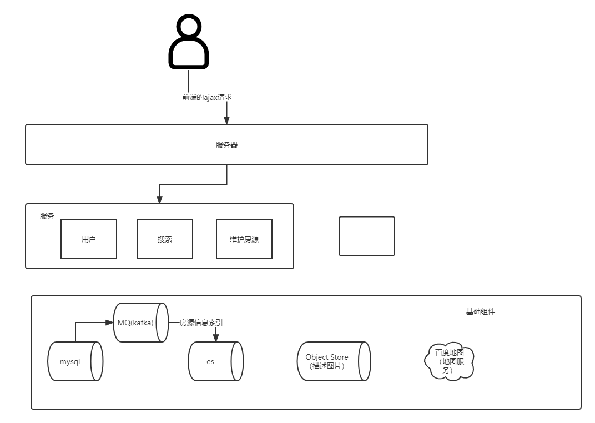

# MVP -version
# 目标
做一个找房网站，中介平台

# 开发功能点
1. 搜索房源信息，（贝壳，自如） 
2. 维护房源信息，（title, 简介，图片，位置，分类， 。。。）
3. 用户（顾客，管理员， opt）

# 系统架构

## 搜索
。。。

## 用户
1. oauth2
2. jwt 
3. seesionid, - object(session)

## 维护房源
员工权限
调用api 对存储，baidu api

-事务 -> 分布式事务